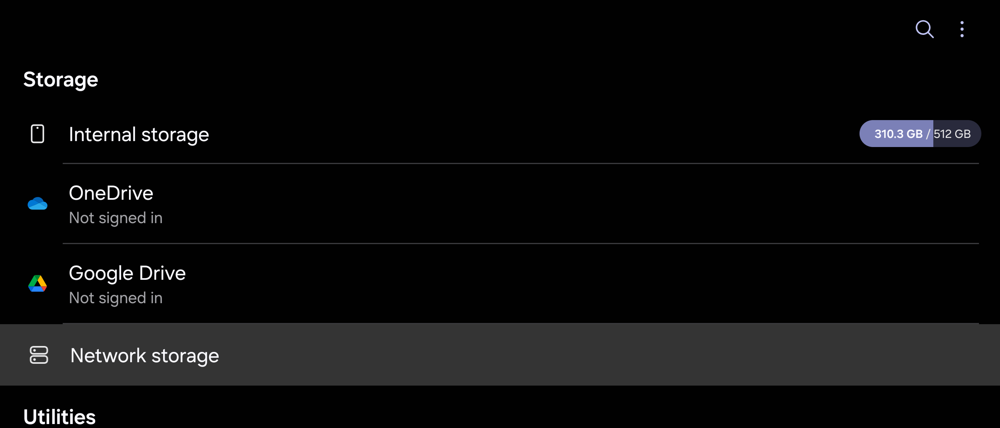
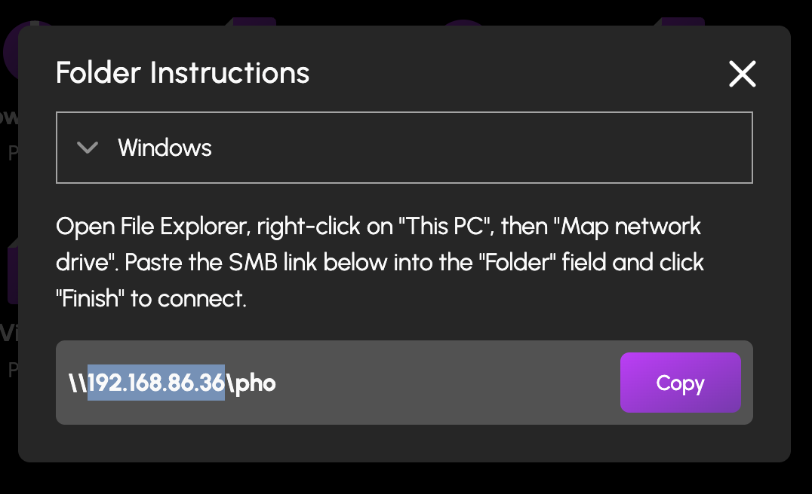
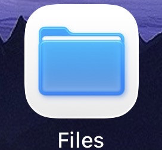

# How to Access Files and Folders Over the Network

In HexOS, you can [create folders](/features/folders/create-a-new-folder) through the deck, but you can’t add contents to the folders via the deck.  
The folder contents are added, viewed and edited from another device *over the network*. This means folders are accessed using a computer, laptop or phone connected to the same network. 

This guide will explain how to access a folder on your HexOS server from a variety of other devices.
>Note: Some apps may require different methods to add or view data. In Immich, for example, you upload photos and videos via a web browser.

## Copying the Address of a Folder

1. In the folders screen of your [HexOS deck](https://deck.hexos.com), select on the folder you want to access
2. Select the **Browse** button

You will be given the folder IP address needed to connect to it from other devices on the same network. You can select the Copy button to copy a link and paste it following the instructions below.

You can select Windows or Mac using the dropdown.

Changing the Windows/Mac setting doesn't modify the folder, it just provides instructions for the selected operating system.

## Accessing the folder from your device

Here are some examples of how to access the file from various devices. The specific method may vary a little depending on your operating system.

### On Mac

1. Open Finder
2. Select "Go" in the menu bar
3. Select "Connect to Server"
4. Paste the SMB link into the "Server Address" field
5. Select the "Connect" button

### On Windows
1. Open File Explorer
2. On the left side there is a list of folders and locations, select **This PC**

1. Right click for the menu 
2. Select **Add a network location**

Follow the wizard though by selecting the **Next** button.

Select the **Next** button on the **Choose a custom network location** step.

Paste the folder address in and select the **Next** button.

You can optionally choose a display name. Select the **Next** button.

Then select the **Finish** button.

Your folder will now be accessible from your file browser.

If the folder is private you will be asked for a username and password before it will open.

### On ChromeOS

Open the My Files app.

1. On the top right, select the menu button (three vertical dots)
2. Select Services
3. Select SMB File Share

1. Then select a suggested share from the list or manually enter the URL using the given in the windows section "\\\ipaddress\Folder-name"
2. Fill out the password field if required
3. Select **Add**

The file will now show in the left hand navigation on My Files

### On Linux

This varies depending on your linux distro. The url required will likely be similar to the Mac one, with forward slashes (rather than windows and chrome with \\ back slashes). The following example is from Fedora.

1. Open your files app
2. Select **Network**
3. Paste in the folder address 

1. Fill in the username and password if needed
2. Select **Connect**

You will now see the folder in your Networks section of your file manager and also as a shortcut at the bottom of the left hand navigation of files

Sometimes the folder may show under **Other locations** 

## Android

### Samsung Galaxy

1. Open `My Files` app

2. Select network storage
    - You may be prompted to update the app

3. Select the + button at the top right corner

4. Select Network Drive (SMBv2/SMBv3)

5. If your server appears select it, if not select `add manually`

6. Fill this out with your information and press `add` 
- The `Address` can be found at the folders screen of [HexOS deck](https://deck.hexos.com/folders)  
          1. Select any folder  
          2. Select the `Browse` button
          
          3. The address will be just the numbers shown (highlighted in this example)
          
     - You can leave the port alone
     - Username and password are optional but if you would like to use them then uncheck `Sign in anonymously`

### Google Pixel

There isn't a native function on pixel devices to access SMB network shares. 
SMB network shares can still be accessed by installing 3rd party applications.

## iOS

1. Open the `Files` app

2. Press the 3 horizontal dots button on the top right corner

3. Select `Connect to Server`

4. Type your server ip address in the `Server` textbox 
    - The `Address` can be found at the folders screen of [HexOS deck](https://deck.hexos.com/folders)
        1. Select any folder
        2. Select the `Browse` button
        
        3. The address will be just the numbers shown (highlighted in this example)
        
        

5. Select `Guest` or `Registered User`
    - Input your username and password if you would like to log in as a registered user

6. You can find your server under the Shared section. 
