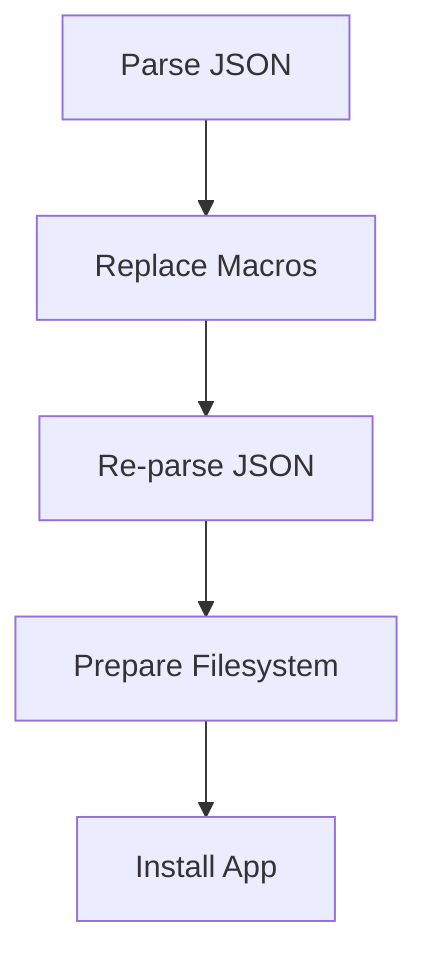

# Validation

Pipeline:

| Step           | Typical errors    | Example message                 | Fix                                   |
| -------------- | ----------------- | ------------------------------- | ------------------------------------- |
| Parse JSON     | Missing version   | requires "version": 1           | Add version                           |
| Replace Macros | Unquoted macro    | expected JSON after replacement | Quote macro strings                   |
| Prepare FS     | Permission denied | failed to apply ACL             | Use POSIX fallback or adjust pool ACL |
| Install        | Chart validation  | invalid value for port          | Match the UI field type               |
