# Migrating Immich to New Storage Configuration

## Prerequisites

- This guide requires at least enough storage space free on a pool to create another copy of your current immich installation including media such as photos and videos.
- This guide only applies to 
   - curated immich installations that have not been customized
   - users that can still access the immich web-ui
   - users with immich Version `v1.135.0` and higher
     1) Select `Apps` on the left side bar
     2) Click on the `immich` app on the list (Not the Checkbox)
     3) View the `Application Version` in the Application info card
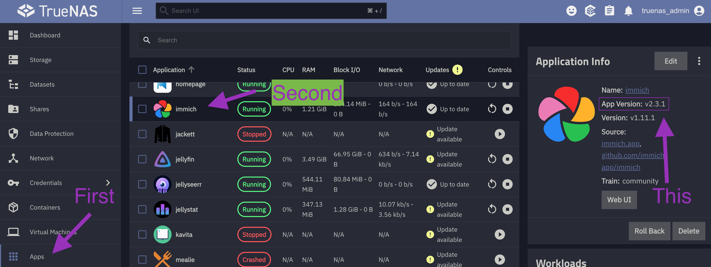

## Preparation
- Note the contents of the `Photos` folder
   - This can be done by viewing the `Photos` folder via SMB shares.
   - [Instructions for how to access folder contents can be found here](docs/features/folders/how-to-access-folder-contents.md)
- Stop the `immich` application
- Log into TrueNAS UI
   1) Navigate to [HexOS Deck](https://deck.hexos.com)
   2) Navigate to the settings panel by selecting it on the left sidebar
   3) Select the TrueNAS button
   4) Login
       - The username will be `truenas_admin`
       - The password will be what you selected when first installing HexOS

## Creating Datasets

Once in the TrueNAS interface we will
1) Select `Datasets` in the left sidebar</br>
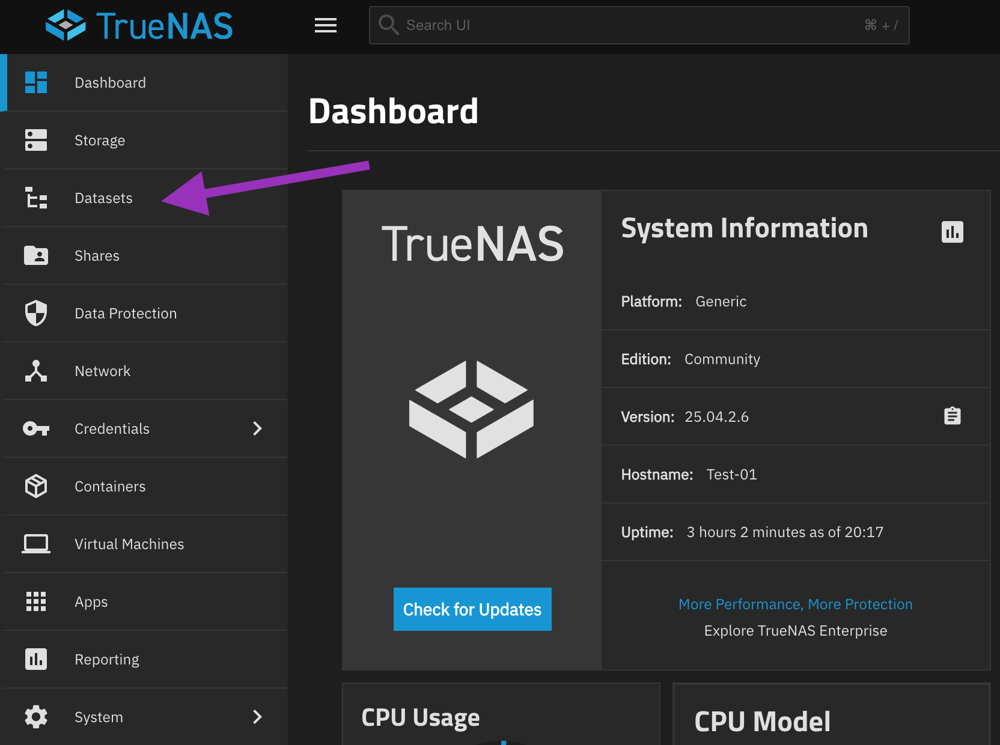
2) Click on the pool with your `Photos` folder and press `Add Dataset`</br>
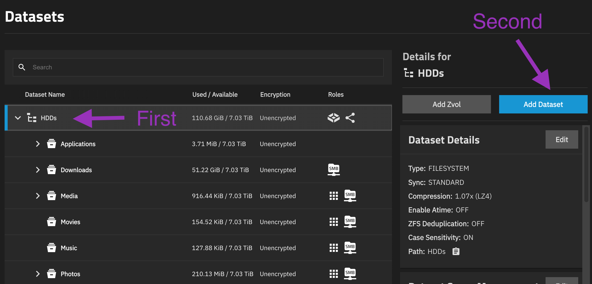
3) Name the Dataset `Photos2` and select `save`</br>
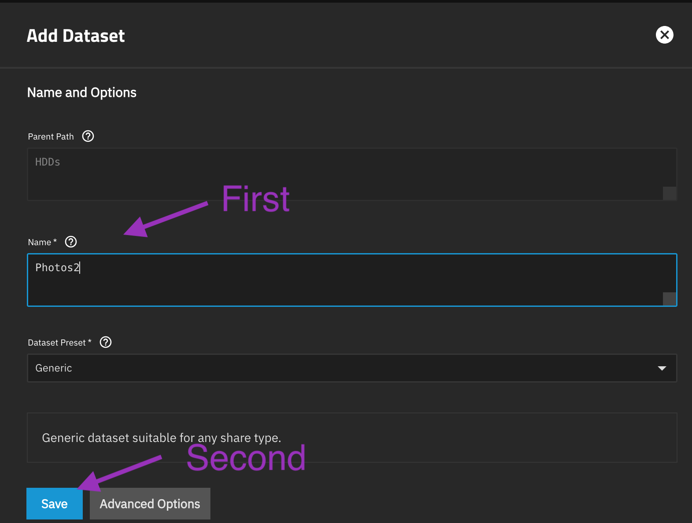
4) Click on the original `Photos` dataset and then press `Add Dataset`
5) Name the Dataset `immich`, set the Dataset Preset to `Apps` and then select `save`</br>
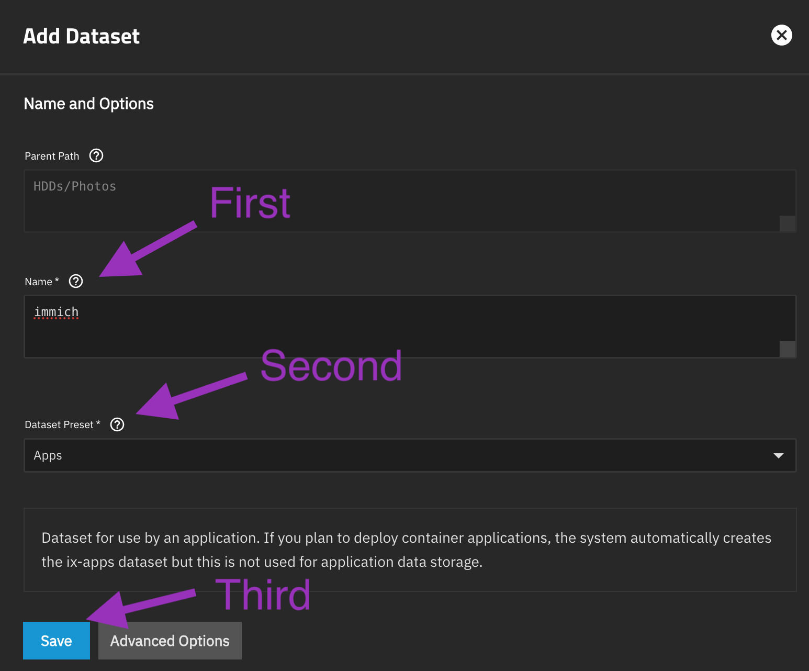

## Copying Files

1) Select `System` in the left sidebar
2) Select `Shell` in the new sidebar</br>
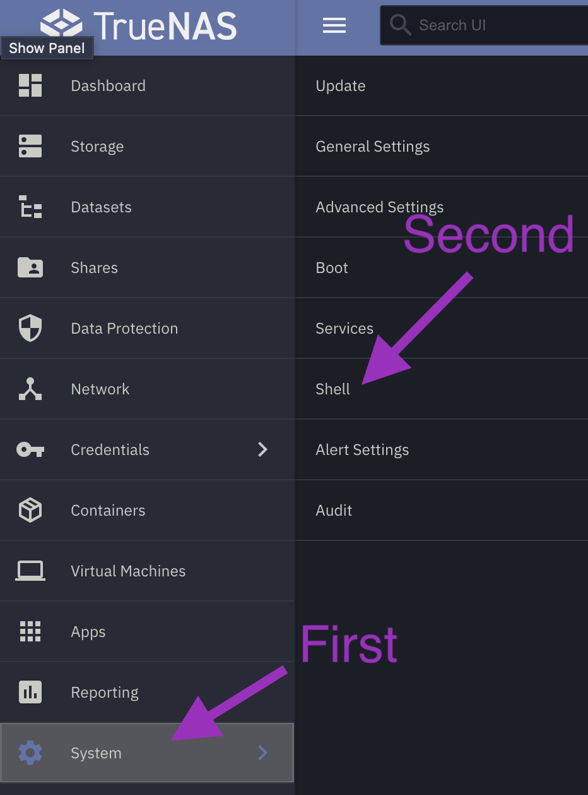
3) Type `tmux` into the shell and press enter
   - This creates a session of the terminal that will keep going even if the TrueNAS web-ui times out
   - If the TrueNAS web-ui times out you can return to `shell` and type `tmux attach` to renter the session
4) Input the following commands in sequential order
   - There will be a prompt for the admin password
   - When you enter the admin password the screen will not show any characters as a security feature
   - When the password is fully inputted the command will run after pressing `enter`
> **Note:** The following commands are for users that have their Photos and Applications on HDDs

> **Note:** When accessing shell from a Windows computer, the paste command is changed to `Shift + Insert`

``` 
 sudo rsync -avh --stats --progress /mnt/HDDs/Photos/ /mnt/HDDs/Photos2/
```  
``` 
 sudo rsync -avh --stats --progress /mnt/.ix-apps/app_mounts/immich/backups/ /mnt/HDDs/Photos/immich/backups/ 
``` 
``` 
 sudo rsync -avh --stats --progress /mnt/HDDs/Applications/immich/profile/ /mnt/HDDs/Photos/immich/profile/ 
``` 
``` 
 sudo rsync -avh --stats --progress /mnt/HDDs/Applications/immich/thumbs/ /mnt/HDDs/Photos/immich/thumbs/ 
``` 
``` 
 sudo rsync -avh --stats --progress /mnt/HDDs/Applications/immich/encoded_videos/ /mnt/HDDs/Photos/immich/encoded-video/ 
``` 
``` 
 sudo rsync -avh --stats --progress /mnt/HDDs/Applications/immich/uploads/ /mnt/HDDs/Photos/immich/upload/ 
``` 
``` 
 sudo rsync -avh --stats --progress /mnt/HDDs/Photos2/ /mnt/HDDs/Photos/immich/library/ 
``` 

## Updating Immich

1) Select `Apps` in the left sidebar</br>

2) Select `immich` 
3) Verify `immich` app version is **1.132.0 or higher** in the application information card again
4) Select `Edit` in the application information card</br>
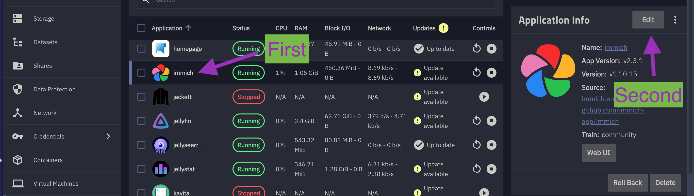
5) Scroll down to the storage section
6) Uncheck `Use old storage configuration`</br>
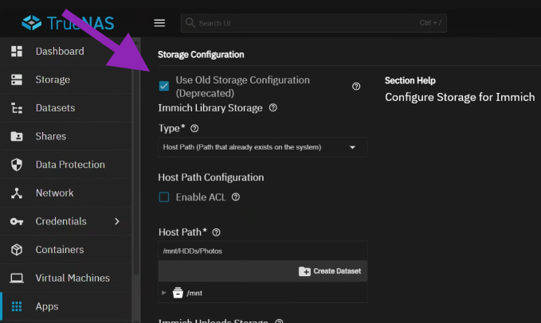
7) Select `Host Path` for Data Storage (aka Upload Location)
8) Set the Host path to `/mnt/HDDs/Photos/immich`</br>
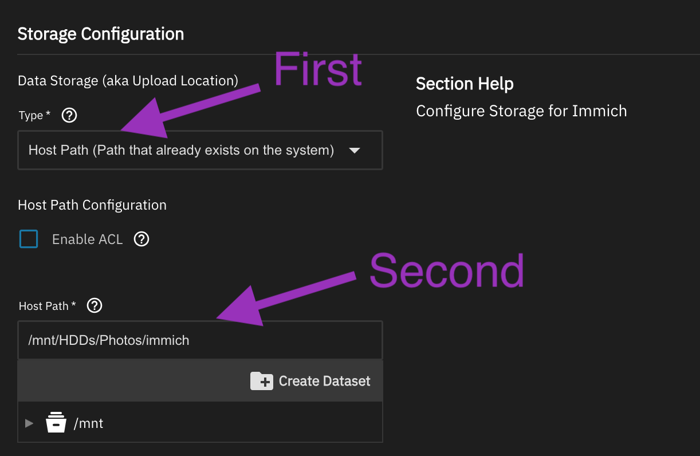
9) Scroll down to the bottom and select the update button
10) Verify if the immich web-ui is working
11) If immich Web-UI is working as expected, update the immich app in [HexOS Deck](https://deck.hexos.com)
12) Verify if the immich web-ui is working and shows the most up to date version of immich

## Cleaning up

1) Stop the immich application
2) we will be deleting the old datasets to free up storage space (Optional)
   1) Select `Datasets` in the left sidebar
   2) Click on the `Photos2` data set created earlier, press the `clipboard` to copy and press `Delete`</br>
   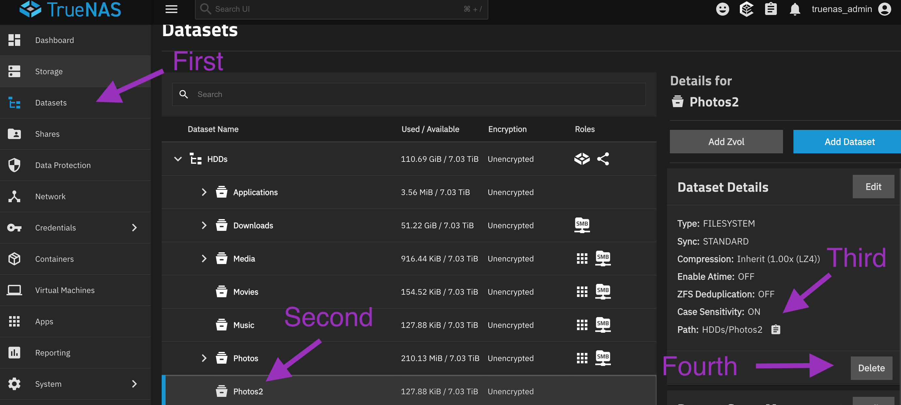
   3) Follow the on-screen prompts to confirm deletion</br>
   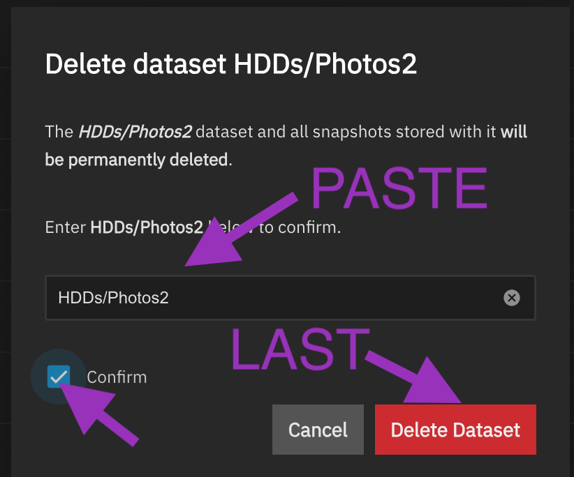
   4) Navigate to the ~/Applications/immich/ dataset
   5) Delete the `Backups`, `encoded-video`, `profile`, `thumbs` & `upload` datasets. </br>
> <span style="color: red;">**Warning**: Do not delete the `postgres_data` dataset in the ~/Applications/immich/ dataset</span>
3) Open the original `Photos` folder using SMB again.
   1) Refer to the contents noted in the preparation section of this guide
   2) Make your hidden files visible
       - Mac: In the Finder app while in the `Photos` folder and then press `Command + Shift + Period` to toggle hidden files.
       - Windows: [Refer to these instructions](https://support.microsoft.com/en-us/windows/file-explorer-in-windows-ef370130-1cca-9dc5-e0df-2f7416fe1cb1#windowsversion=windows_11)
   3)  Delete all files & folders **other than** the `immich` folder and any files & folders you added to the `Photos`folder 
4) Re-enter shell
5) Type `tmux kill-server` and press enter
6) Verify the tmux session has ended by entering `tmux attach`
7) Restart the immich application and verify if the web-ui is working.
