# Updating Immich to use Postgres 18

## Overview

- This guide applies to users unable to update Immich and getting the following error
 `[EINVAL] immich.postgres_image_selector: Input should be 'vectorchord_18_image'`
- This guide only applies to users that are still able to access the Immich WebUI


## Logging into the TrueNAS WebUI

- Log into TrueNAS UI
   1) Navigate to [HexOS Deck](https://deck.hexos.com)
   2) Navigate to the `settings` panel by selecting it on the left sidebar
   ::: details Image
   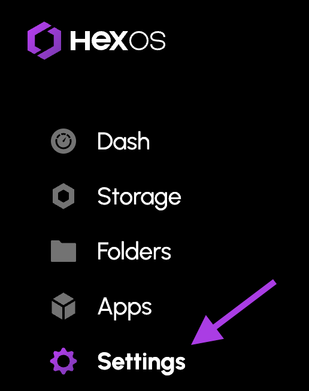
   :::
   3) Select the `TrueNAS` button
   ::: details Image
   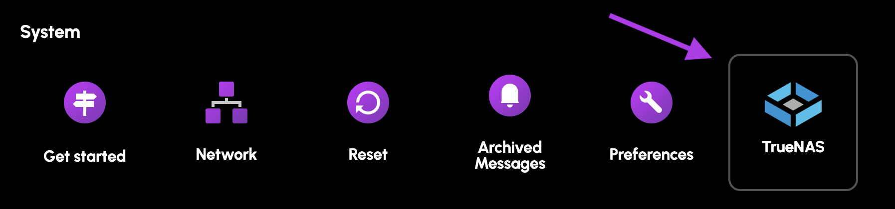
   :::
   3) Select the new `TrueNAS` button
   ::: details Image
   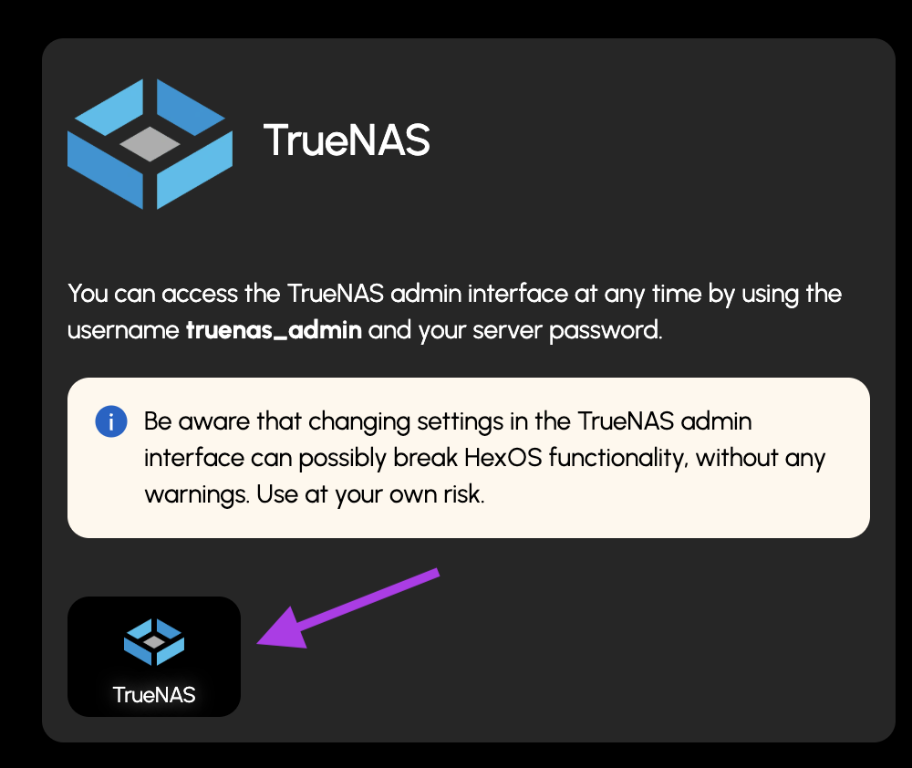
   :::
   4) Login
       - The username will be `truenas_admin`
       - The password will be what you selected when first installing HexOS
       ::: details Image
       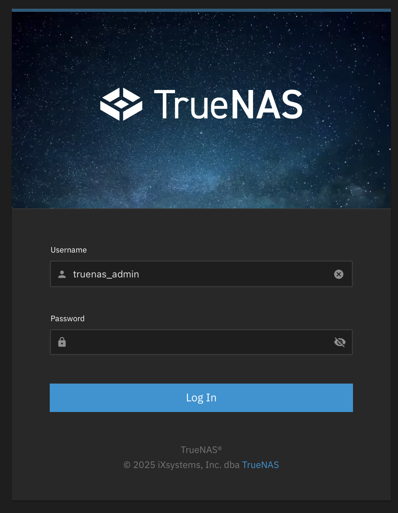
       :::

## Updating Process

1) Navigate to the `Apps` tab
::: details Image
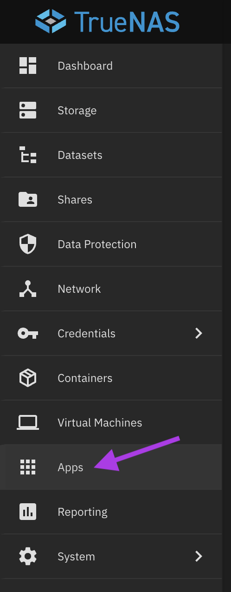
:::
2) Click on the Immich line
::: details Image
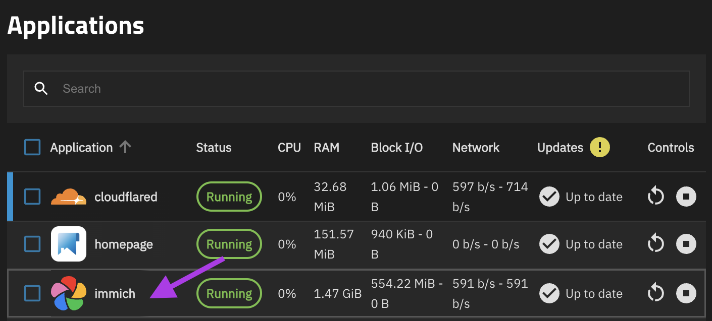
:::
3) Stop Immich
::: details Image
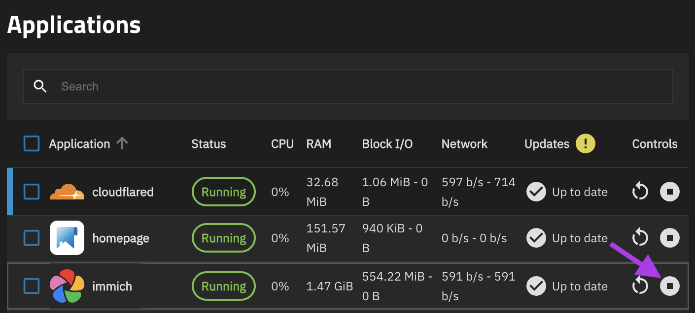
:::

4) Determine Immich `version` on the `Application Info` card
> **Note:** Not to be confused with `App Version`
::: details Image
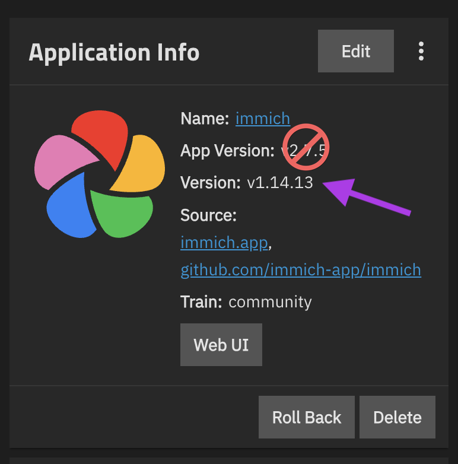
:::
5) Modify the following command to include your Immich `Version`
```
sudo nano /mnt/.ix-apps/app_configs/immich/versions/<insert_your_immich_version>/ix_values.yaml
```
In this example the command would be
```
sudo nano /mnt/.ix-apps/app_configs/immich/versions/1.14.13/ix_values.yaml
```
6) Navigate to the `System` tab and then select `shell`
::: details Image
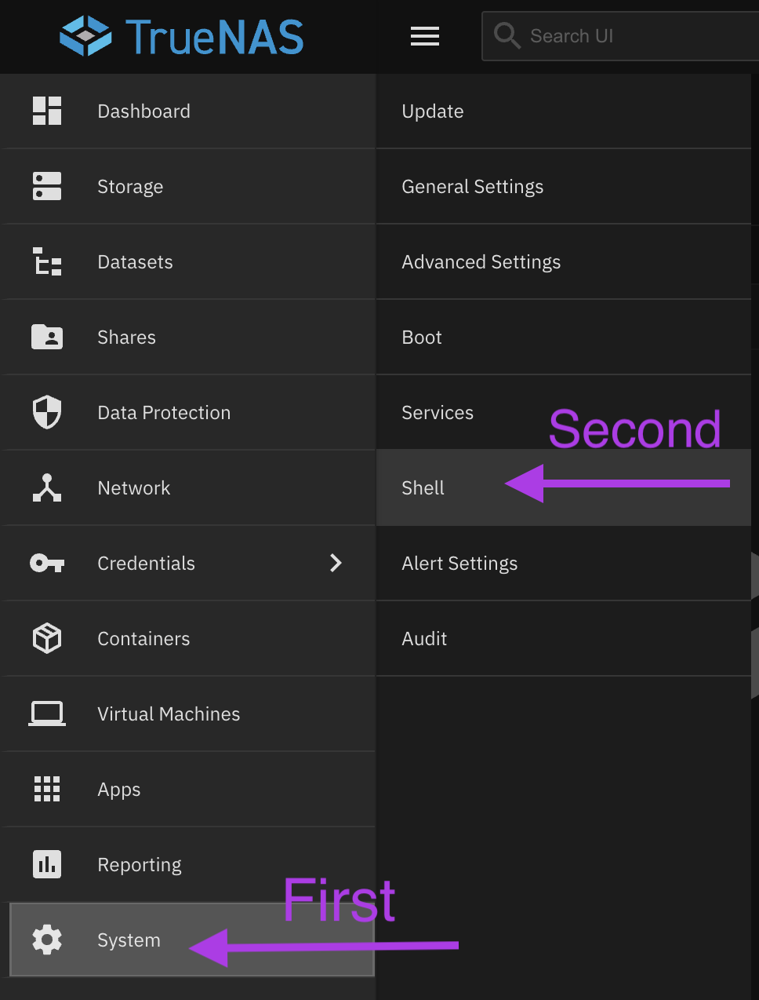
:::
7) Paste the command created in step 4 and press enter
> **Note:** To paste things in shell you need to press `Shift + Enter`
8) You will be asked to enter your password.
     - This is the same password used to login into TrueNAS
     - There will be no input shown on screen as a security feature
     - When you finish entering your password you can press enter
::: details Image
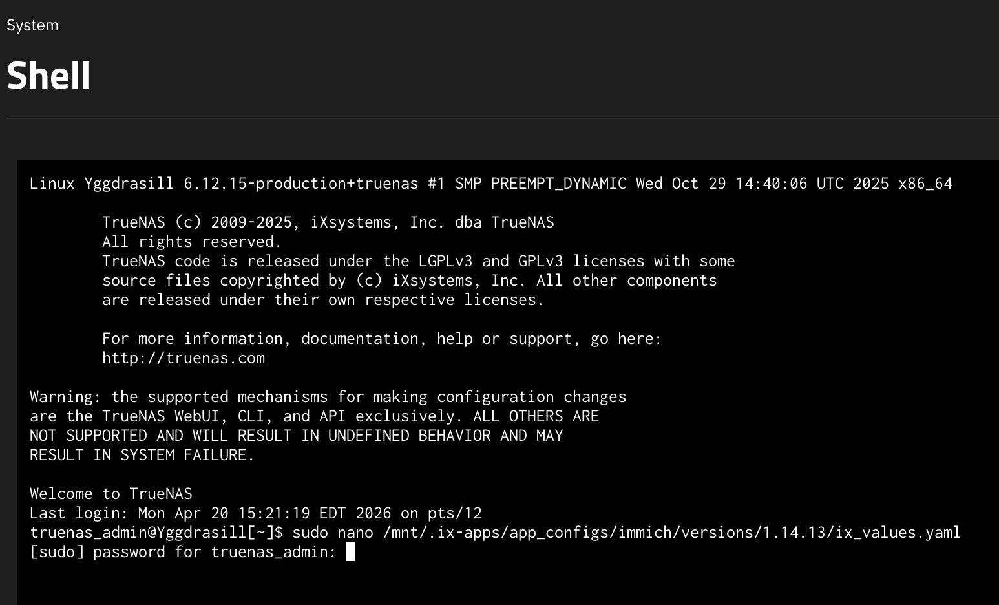
:::
9) Use your arrow keys to scroll down to the `postgres_update_image` section
::: details Image
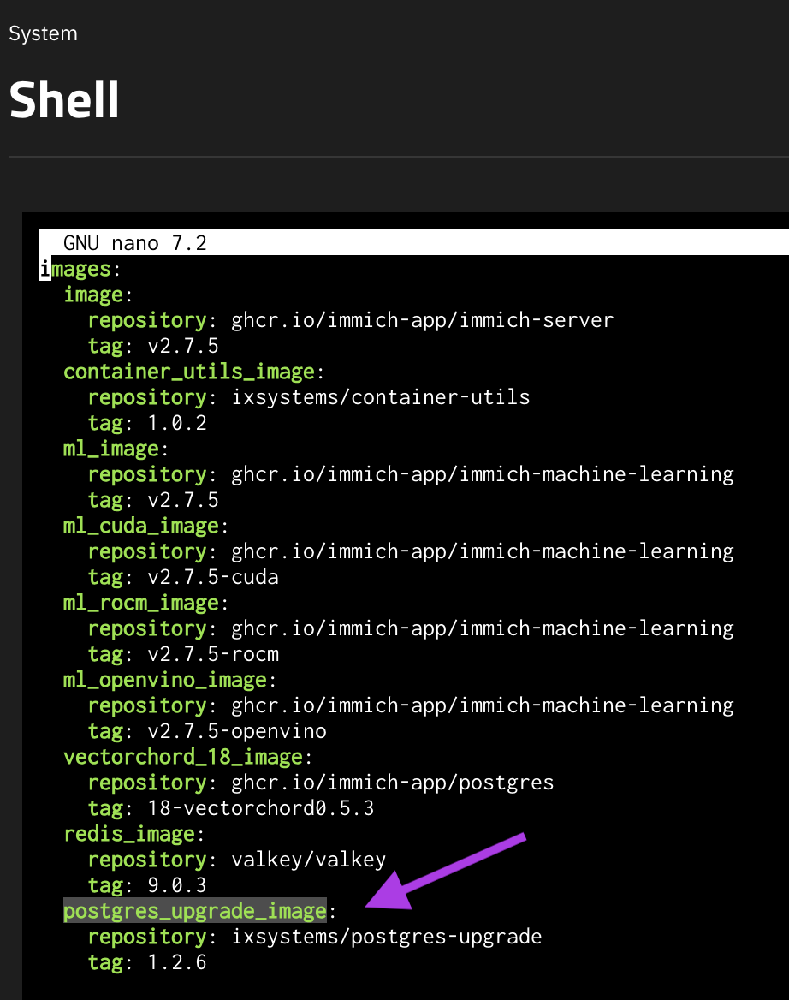
:::
10) Change the `tag` to `1.1.11`
::: details Image
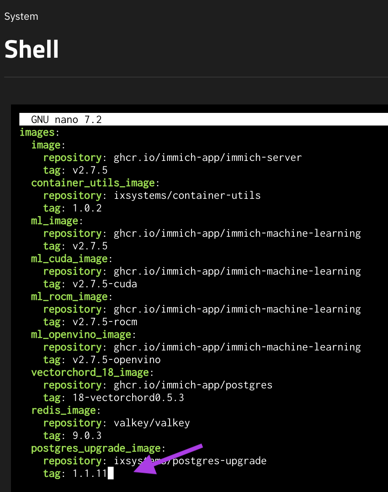
:::
11) Save the changes
     1) Press `Control + X` to exit
     ::: details Image
     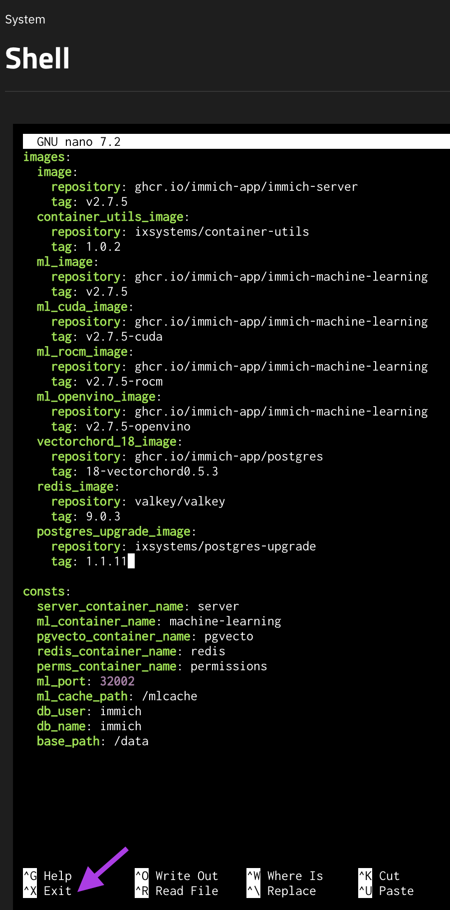
     :::
     2) Press `Y` to save
     ::: details Image
     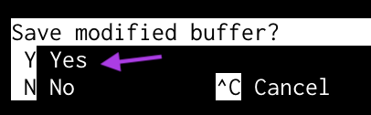
     :::
     3) Press `Enter` to save the file name
     ::: details Image
     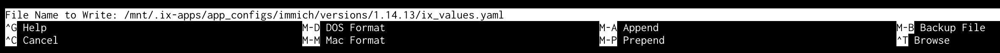
     :::
12) Return to the `Apps` tab
::: details Image

:::
13) Click on the Immich line
::: details Image
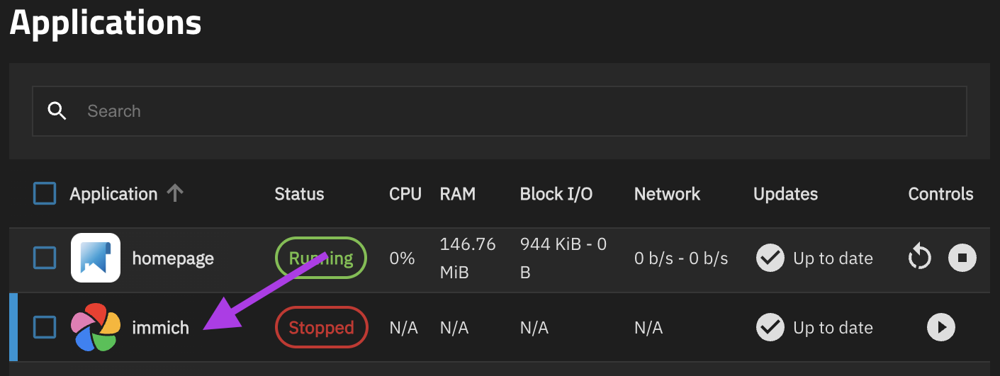
:::
14) On the `Application Info` card press `edit`
::: details Image
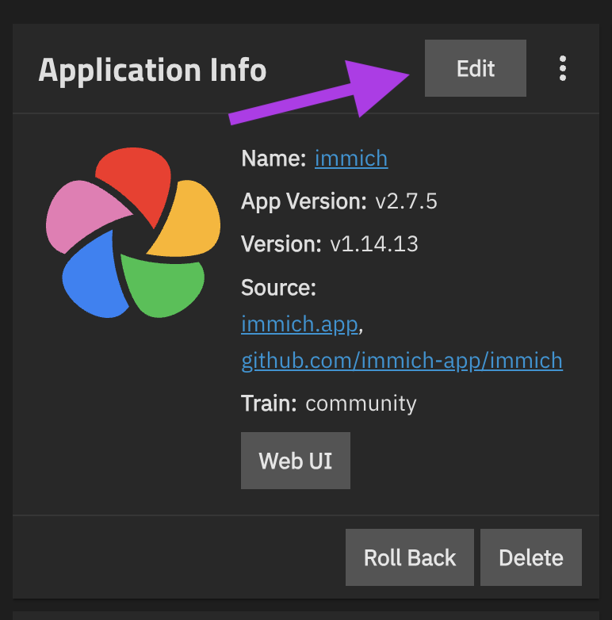
:::
15) Edit the `Postgres Image (CAUTION)` line to `Postgres 18`
::: details Image
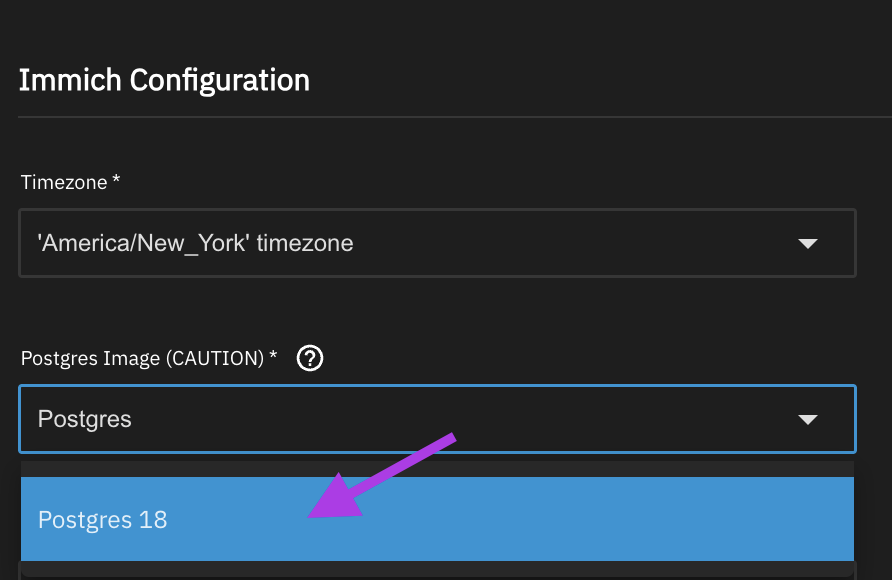
:::
16) Scroll all the way down and press the `Update button`
17) Start the Immich app
::: details Image
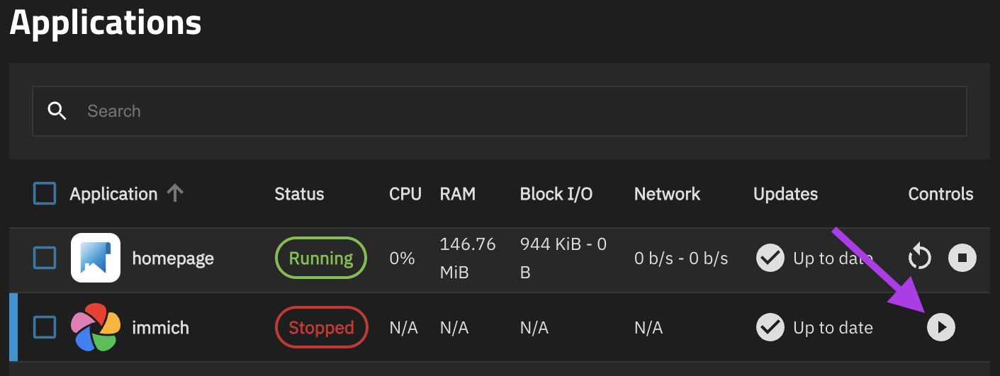
:::
> **Note:** Starting Immich will take longer than usual this time.
18) Once Immich has the `Running` status open the WebUI and make sure Immich is functioning normally
::: details Image
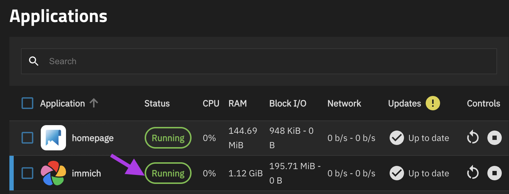
:::
19) Update the Immich app in HexOS

 

## If you still can't update Immich

If you are still having trouble updating Immich please reach out to `support@hexos.com`

## Community credits 

`sunny_raven` - Created the original guide in the HexOS forums

`BruteNas` - Provided the instructions to saving files in shell

Also a big thank you to everyone that contributed on [github](https://github.com/truenas/apps/issues/4628) to find a solution