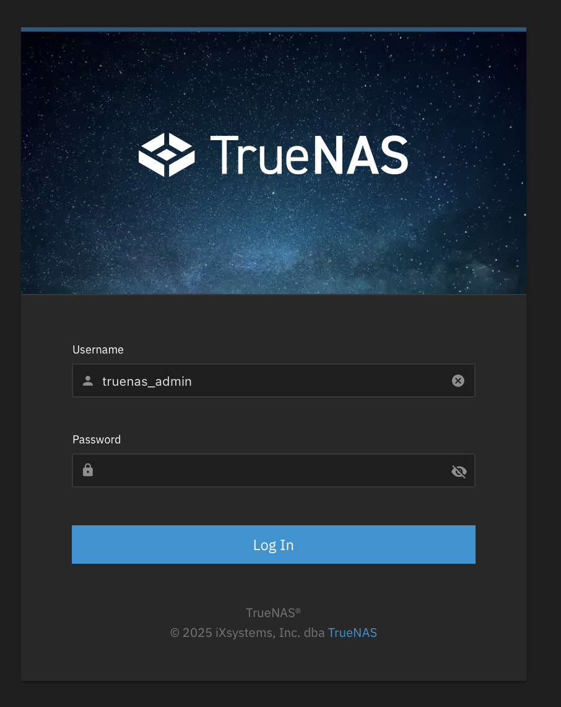
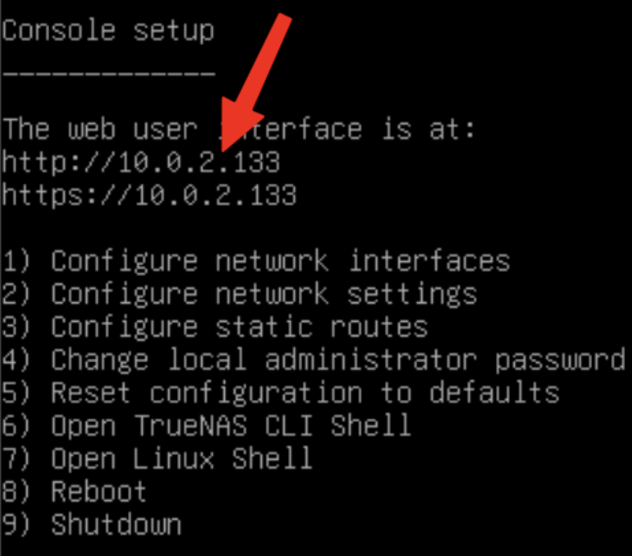
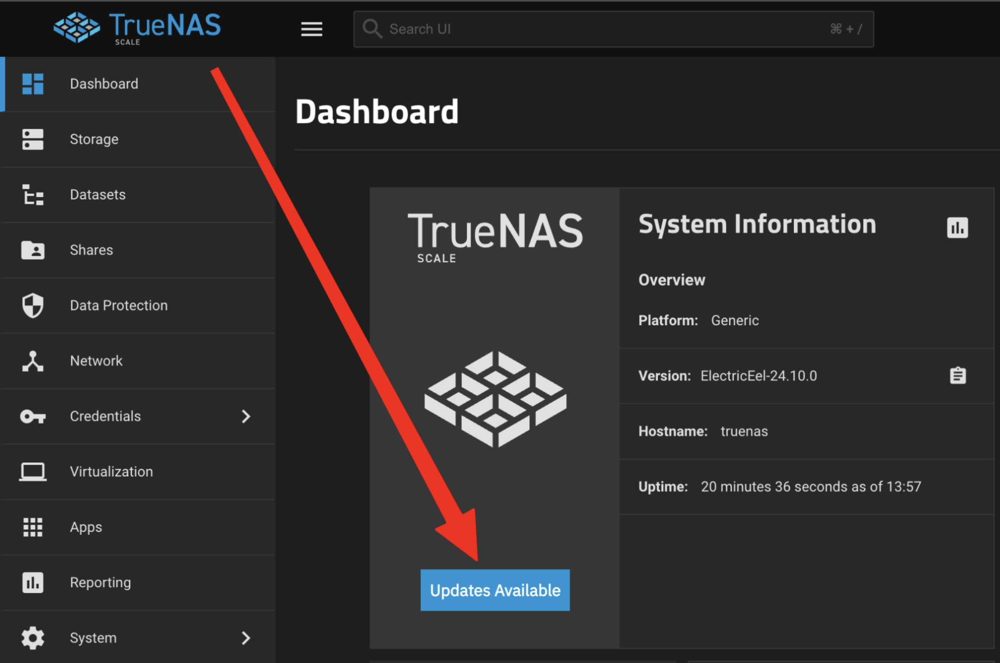
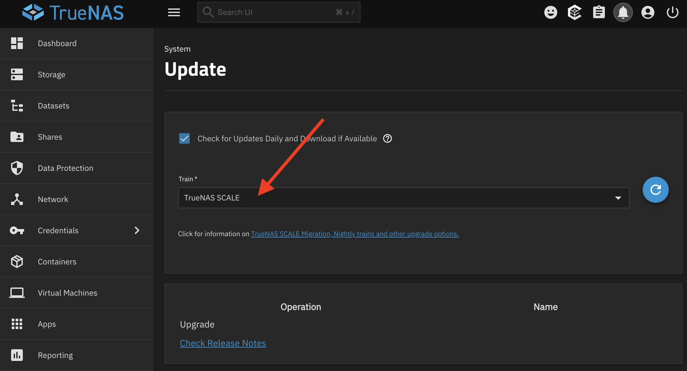
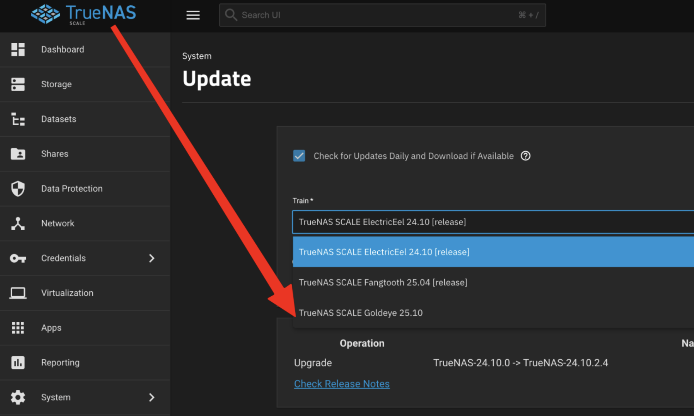
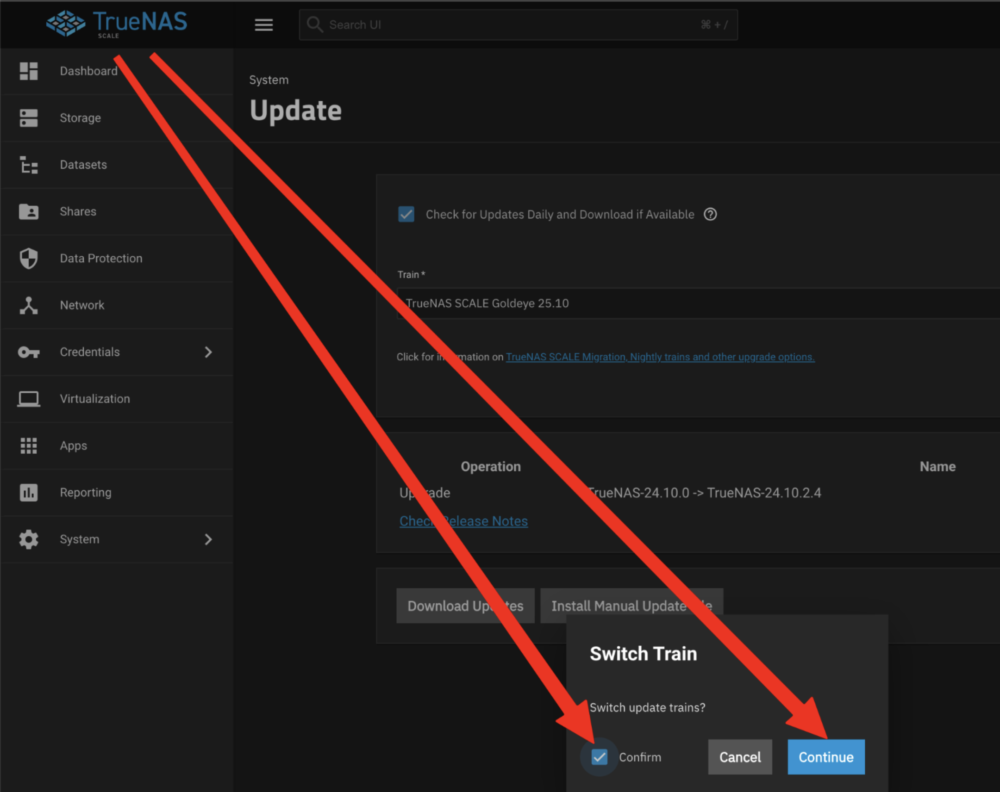
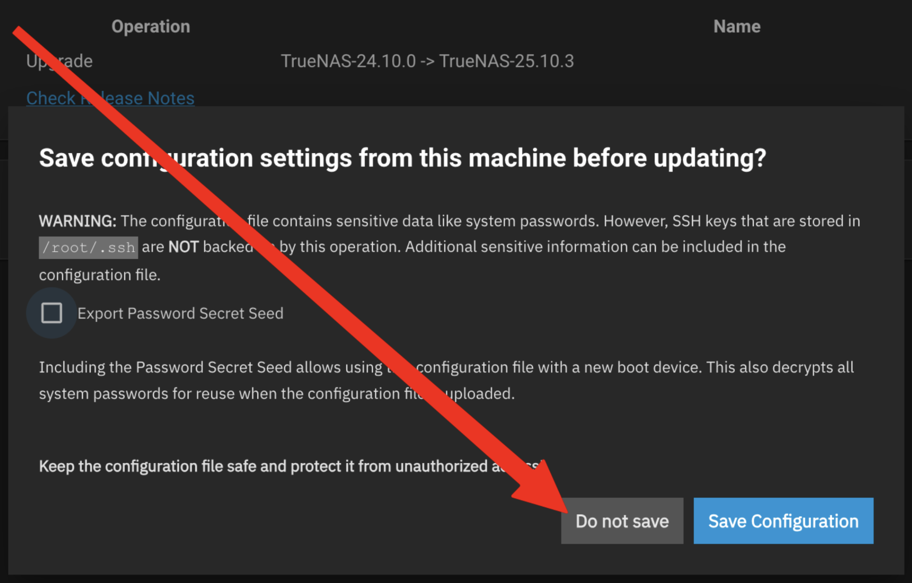
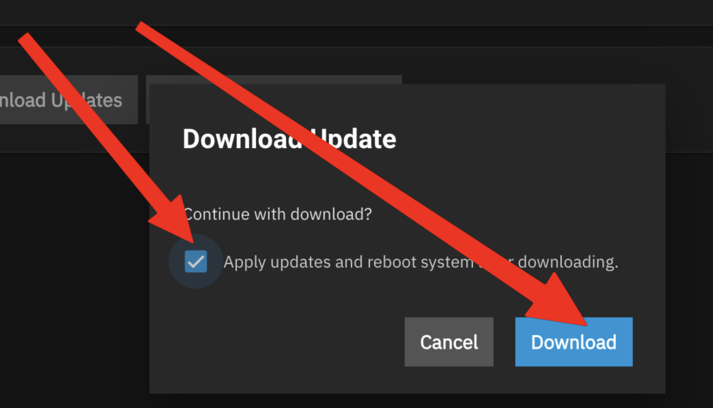

# Upgrading HexOS with TrueNAS 24.10.0 to TrueNAS 25.10.3

## Overview

With the HexOS update to 1.0 with Local UI any system still running older versions will need to upgrade TrueNAS to work with HexOS 1.0. 

> **Warning:**  New versions of TrueNAS can remove support for older hardware. A device that works now may stop working after an update. For example, Nvidia no longer supports GTX 10-series and older GPUs, so you now need a GTX 1650 or newer.

## Logging into TrueNAS UI

:::details If you can access HexOS deck (easier method)
   1) Navigate to [HexOS Deck](https://deck.hexos.com)
   2) Navigate to the settings panel by selecting it on the left sidebar
   3) Select the `TrueNAS` button
   4) Login
       - The username will be `truenas_admin`
       - The password will be what you selected when first installing HexOS

:::

:::details If you can't access HexOS deck (harder method)
   1) Connect a display to your server.
   2) When turned on the server will show your `ip address`

   3) Type the `ip address` into your browser
   4) Login
       - The username will be `truenas_admin`
       - The password will be what you selected when first installing HexOS

:::

## Updating Process

1) Select the blue `Updates Available` button

2) Click the `Train` dropdown

3) Select `TrueNAS SCALE Goldeye 25.10` in the dropdown

4) Confirm changing the train

5) Select the `Do not save` button

6) Select `Apply updates and reboot system after downloading` and the click `Download`

## If you still can't connect to HexOS deck

If you are still having trouble claiming your server or connecting to HexOS deck please reach out to `support@hexos.com`
