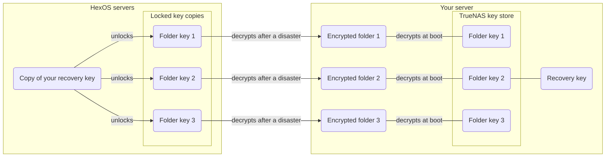

# Folders

Folders can be used to organize data, share files over the network and for backups with tools like Apple Time Machine. You are able to create folders and they can be automatically created when applications are installed. 

Folders can optionally be encrypted for data protection. You can also create users and decide what they can view and edit.

## The folders screen

You can access the Folders screen in the [Deck](https://deck.hexos.com) through the sidebar menu. On this screen you can view existing folders, create new folders and network credentials for accessing folders. 

 Folders screen in Deck 

{.medium .framed}

The Folders screen shows your folders, not their contents. To look inside one, click the folder and then click **Browse** to open the [file browser](/features/file-browser). You can also [connect your computer to the folder over the network](/features/folders/how-to-access-folder-contents).

## Folder permissions

### Permission types

You can give users specific types of access to folders:

#### Read access

Users with read access can view or download folder contents but can't edit or delete the contents.

#### Write access

Users with write access can add, modify or delete the contents of the folder.

## Folder types

### Public folders 

Anyone can access these folders. This will include all users you have created. This means that anyone with access to your network can view, edit or delete the contents of these folders.

### Private folders

Only those with network credentials created in HexOS can access these folders.  This means by default only the administrator has access. The administrator grants access to anyone given network credentials. Folder permissions for this type of folder can be modified.

- Anyone with access to your network is able to see private folder names. 
- Anyone with access to the hard drives in your server may be able to read the data.

### Encrypted folders

Encrypting a folder scrambles its contents so they can only be read with the right key. All files placed in an encrypted folder are encrypted automatically. The server administrator can lock or unlock folders from the Folders screen in the Command Deck. When a folder is locked, it and its contents are not visible or accessible to anyone on the network. When unlocked, it works the same as any other folder.

- Encrypted folders can be public or private.
- Encryption is required for backing up a folder to another server.
- The data on your server’s storage drives cannot be read even if someone gains physical access to them.

#### Key management

There are two ways to manage your encryption key:

**Autogenerated (recommended):** HexOS generates a random key and manages it for you. The folder unlocks automatically when your server restarts, and you have nothing to remember. A backup of the key is stored securely with your HexOS account and protected by a per-server recovery key. This is the default for new encrypted folders.

**Manual (passphrase):** You choose a passphrase that you must enter to unlock the folder after every server restart. The passphrase must be at least 8 characters long.

You can switch between autogenerated and manual key management from the folder’s page at any time. Switching changes how the key is kept: it does not encrypt your files again, so it finishes straight away.

Encryption is the default for new folders and is what we recommend for data safety. With managed encryption, HexOS handles everything: your folders are protected at rest, they unlock automatically when your server restarts, and you have nothing to remember or type.

#### Turning on encryption

Encryption can be enabled when you create a folder, or turned on later from the folder’s page. An unencrypted folder's page shows **This folder is unencrypted**: click **Turn on**, then choose **Autogenerated** or **Manual** the same way as when creating a folder.

HexOS picks one of two ways to convert the folder, depending on the free space in your pool. The dialog tells you which one it will use before you start.

- **Copy:** when there is room for a second copy of the folder, HexOS builds an encrypted copy, including the folder's snapshots, while you keep using the folder. At the end the folder goes offline for a few minutes while HexOS copies the last changes, checks that every snapshot arrived intact, and swaps the encrypted folder into place.
- **Move:** when there is no room for a copy, HexOS moves your files into the encrypted folder a batch at a time, freeing space as it goes. The folder is offline for the whole conversion, and it takes longer. This is only possible for a folder with no snapshots and no datasets inside it.

Before a conversion can start:

- **Apps** that use the folder must be stopped. The dialog has a **Stop apps** button. Start them again from **Apps** once the folder is encrypted.
- **Shares** from elsewhere that reach into the folder must be turned off in TrueNAS. The folder's own share is turned off and back on for you.
- **Backups:** a folder already backed up to one of your own servers must be removed from that backup first.
- **Space:** if the pool is too full, the folder's page tells you how much space to free.

**The unencrypted original:** with **Remove the unencrypted original once verified** ticked (the default), HexOS removes the original only after it has checked that the encrypted folder holds all of it. If HexOS cannot complete that check, it keeps the original beside the folder, named like `Music-unencrypted-20261003`, and the folder's page says so. Your encrypted folder is complete and in use either way; the original only takes up space. Check the encrypted folder has what you expect, then click **Remove original**.

If a conversion stops part-way, the folder's page explains what happened and offers **Retry**. A copy leaves the original untouched; a move keeps every file in either the original or the encrypted folder, never neither.

Encrypted files can take slightly more space than the originals. If the folder has a size limit and the encrypted files no longer fit inside it, HexOS raises the limit by the difference and says so on the folder's page.

> **Info:** Turning on encryption is a one-way change. Once a folder is encrypted, it cannot be reverted to unencrypted. If you need an unencrypted copy of the data, create a new unencrypted folder and transfer the files using the [file browser](/features/file-browser).
{.is-info}

#### Where your keys are kept

Every encrypted folder has its own key. With an autogenerated key, HexOS keeps that key in more than one place, so that losing your server does not mean losing your data.

- **Purple dotted:** what is on HexOS servers while recovery key management is **Managed** (the default).
- **Blue dashed:** what is on HexOS servers with **End-to-end encryption**. The copies are locked with your server's recovery key, which HexOS no longer has.
- **Red dashed:** the TrueNAS key store on your server. The folder keys here are not locked with anything else.
- **Green:** your server.

| Where | What is kept | What it is for |
|---|---|---|
| TrueNAS key store, on your server | Each folder's key | Unlocks your folders when the server starts. You can export a key from here (see below). |
| The HexOS app, on your server | Your server's recovery key | Locks the copies of your folder keys that HexOS keeps. |
| HexOS servers | A copy of each folder key, locked with your recovery key | After a disaster, a new HexOS server signed in to your account uses these copies to unlock your folders. |
| HexOS servers, **Managed** only | A copy of your recovery key | Lets HexOS open the locked copies for you, so recovering a server needs only your HexOS sign-in. |
| Your buddy's server | Your encrypted data only | Never any key. A buddy cannot read your backup. |

While recovery key management is **Managed**, HexOS also keeps its own sealed copy of each new folder key, which it uses to check that every copy it stores really opens. HexOS opens any of these copies only for a request signed in to your account, and records every attempt.

A folder with a **Manual** passphrase has no key copies anywhere: HexOS does not keep your passphrase. If you lose it, nobody can open the folder or its backups.

#### Recovery keys

Each server has its own recovery key: a 28-character code in groups of four, like `ABCD-EFGH-...`. Your server creates it the first time you open the server in the Command Deck, and keeps it. The recovery key locks the copies of that server's folder keys that HexOS keeps.

The recovery key is not the key to your folders. It is one level above them: together with your HexOS account, it lets a HexOS server open the copies of your folder keys and unlock your folders. Only HexOS uses it. To open a folder on a system without HexOS, use that folder's own key, [exported from TrueNAS](#getting-a-folders-key-out-of-hexos).

To view your recovery key, go to **Settings** > **Recovery key**. You need to have signed in within the last 10 minutes. If it has been longer, HexOS asks you to sign in again first.

**Key management:** in **Settings** > **Recovery key** > **Key management** you choose who keeps the recovery key:

- **Managed** (the default): your recovery key is saved to your HexOS account. If you lose a server, you recover it by signing in with your HexOS account. There is nothing for you to store.
- **End-to-end encryption:** your recovery key is only stored on your server, and HexOS keeps no copy. This improves security, but if you lose your server and your recovery key, your data cannot be recovered.

When you switch to **End-to-end encryption**:

1. Your server makes a new recovery key and shows it to you. Save it somewhere safe, then confirm both acknowledgements.
2. Every folder with an autogenerated key on that server gets a new folder key, locked only with your new recovery key. This runs in the background, a few folders at a time.
3. HexOS removes the old copies once your backups have caught up. A buddy's copy of a folder keeps opening with the old key until its next backup, so the old key stays until then. **Settings** > **Recovery key** lists any folders still waiting.

From then on, if you recover a folder on a new server, HexOS asks you for the recovery key once. You can switch back to **Managed** at any time: your server sends HexOS a copy of the recovery key, and your folder keys stay the same.

**Emergency kit:** the **Emergency kit** button downloads a one-page PDF with your server's name, your HexOS account, the recovery key, and the steps for using it after a disaster. The PDF is made in your browser and the key is not sent anywhere else. Print it or store it somewhere safe and private. Each server has its own recovery key, so each server has its own kit.

**Rotating the key:** if you think your recovery key has been exposed, you can generate a new one. With **Managed**, the new key takes over straight away and your folder keys stay the same. With **End-to-end encryption**, rotating works like switching: save the new key, and your folders move to new folder keys.

> **Warning:** If you keep your recovery key yourself and lose it, HexOS cannot recover your data. Store it somewhere safe.
{.is-warning}

#### Getting a folder's key out of HexOS

HexOS does not show individual folder keys. TrueNAS keeps each folder's key in its own key store, not locked with anything else, so you can export any folder's key from the TrueNAS web interface: open **Datasets**, select the folder, and click **Export Key** in its **Encryption** section. You need these keys if you move your pool to a system without HexOS, or if you stop using HexOS on this server. The step-by-step instructions are in [Download keys for encrypted datasets](/troubleshooting/migrating/import-existing-pools#download-keys-for-encrypted-datasets).

> **Tip:** Switching to **End-to-end encryption**, or rotating the recovery key while you keep it yourself, gives your folders new keys. Export the keys again afterwards: an older exported key will no longer unlock the folder.
{.is-tip}

A folder with a **Manual** passphrase has no key to export: the passphrase is the key.

## Repair access

If your computers can't open a folder or some of the files in it, but HexOS shows the files are there, the folder's info panel offers **Repair access**. See [Repair access to a folder](/features/folders/repair-access).

## Users

Creating additional users is optional. 

Your user account is automatically an administrator: this means you always have full access to all your folders. 

You can create more users in order to grant others access to private folders.
You can grant access to selected users during folder creation. Access to folders can be modified in the folders screen.

User accounts created here only grant folder access through network file browsers like macOS Finder or Windows Explorer. These accounts don't allow any control over your server or applications.

## System folders

When apps are installed, they automatically create "System Folders" for their data. These appear separately from your personal folders and are managed by the apps themselves.

### Reserved names

Certain folder names like "Downloads" are reserved for system use. If you create a folder with a reserved name, it will automatically appear in System Folders instead of your personal folders.

### Default locations

These folders have default locations, but you can change where they're created in [locations](/features/settings/#locations).

