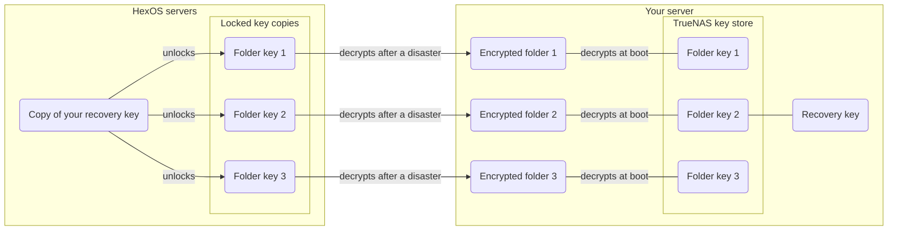

# Folders

Folders can be used to organize data, share files over the network and for backups with tools like Apple Time Machine. You are able to create folders and they can be automatically created when applications are installed. 

New folders are encrypted by default for data protection. You can also create users and decide what they can view and edit.

## The folders screen

You can access the Folders screen in the [Command Deck](https://deck.hexos.com) through the sidebar menu. On this screen you can view existing folders, create new folders and network credentials for accessing folders. 

 Folders screen in the Command Deck 

{.medium .framed}

The Folders screen shows your folders, not their contents. To look inside one, click the folder and then click **Browse** to open the [file browser](/features/file-browser). You can also [connect your computer to the folder over the network](/features/folders/how-to-access-folder-contents).

To make a folder, see [How to create a new folder](/features/folders/create-a-new-folder).

## Folder permissions

### Permission types

You can give users specific types of access to folders:

#### Read access

Users with read access can view or download folder contents but can't edit or delete the contents.

#### Write access

Users with write access can add, modify or delete the contents of the folder.

## Folder types

### Public folders 

Anyone can access these folders. This will include all users you have created. This means that anyone with access to your network can view, edit or delete the contents of these folders.

### Private folders

Only those with network credentials created in HexOS can access these folders.  This means by default only the administrator has access. The administrator grants access to anyone given network credentials. Folder permissions for this type of folder can be modified.

- Anyone with access to your network is able to see private folder names. 
- Anyone with access to the hard drives in your server may be able to read the data, unless the folder is encrypted.

### Encrypted folders

Encrypting a folder scrambles its contents so they can only be read with the folder's key. New folders are encrypted by default. Every file you put in an encrypted folder is encrypted automatically. While the folder is unlocked, it works the same as any other folder.

- Encrypted folders can be public or private.
- A folder you back up to another person's server (a buddy) must be encrypted. Backups to your own servers can include any folder.
- A storage drive taken out of your server on its own cannot be read without the folder's key. The boot drive is different: it holds the keys of folders with an autogenerated key. A buddy who stores your backup cannot read it either.
- A folder you encrypt later can leave pieces of its old unencrypted files on the drives until that space is used again. Erase a drive before you sell it or send it back.

> **Warning:** An **Autogenerated** key does not protect your folder if someone takes your whole server. The key is kept on the server's boot drive so the folder can unlock by itself when the server starts. If someone takes the whole server, including its boot drive, the folder unlocks when they start it. To protect a folder against this, use a **Manual** passphrase: the folder stays locked after every restart until you type it.
{.is-warning}

For what HexOS can and cannot open, how to lock and unlock folders and how to restore them, see [Encrypted folders](/features/folders/encryption).

#### Key management

When you create a folder, you choose how its key is kept:

- **Autogenerated (recommended):** HexOS makes the key. The folder unlocks by itself when your server starts, and there is nothing to remember. HexOS keeps a locked copy of the key with your HexOS account, so you can get the folder back if you lose the server. A folder with an autogenerated key cannot be locked from HexOS.
- **Manual:** you choose a passphrase of at least 8 characters. You type it to unlock the folder after every restart, and you can lock the folder when you want. HexOS does not store your passphrase on its servers.
- **Don't encrypt:** the folder is not encrypted. It can only be backed up to your own servers.

You can change an encrypted folder between **Autogenerated** and **Manual** later, from the **Encryption** tile on the folder's page. This changes only how the key is kept, not the files, so it finishes in seconds. See [Change how a folder's key is kept](/features/folders/encryption#change-how-a-folders-key-is-kept).

> **Danger:** If you lose the passphrase of a folder that has used **Manual** from the start, nobody can open the folder or its backups. HexOS cannot help you get it back. Write the passphrase down and keep it somewhere safe.
{.is-danger}

#### Turning on encryption

A folder that is not encrypted can be encrypted later. Open the folder's page and click **Turn on** in **This folder is unencrypted**. HexOS builds an encrypted version of the folder, checks it, and switches it into place. Depending on the free space on the pool, the folder is offline for a few minutes at the end, or for the whole conversion.

Turning on encryption is a one-way change: an encrypted folder cannot be changed back to unencrypted.

The steps, what can stop a conversion and what to do if one stops are in [Turn on encryption for a folder](/features/folders/turn-on-encryption).

#### Where your keys are kept

Every encrypted folder has its own key. With an autogenerated key, HexOS keeps that key in more than one place, so that losing your server does not mean losing your data.

- **Purple dotted:** what is on HexOS servers while recovery key management is **Managed** (the default).
- **Blue dashed:** what is on HexOS servers with **End-to-end encryption**. The copies are locked with your server's recovery key, which HexOS no longer has once the switch has finished and the old keys are removed.
- **Red dashed:** the TrueNAS key store on your server. The folder keys here are not locked with your recovery key.
- **Green:** your server.

| Where | What is kept | What it is for |
|---|---|---|
| TrueNAS key store, on your server's boot drive | Each autogenerated folder key | Unlocks your folders when the server starts. You can export a key from here (see below). |
| The HexOS app, on your server | Your server's recovery key | Locks the copies of your folder keys that HexOS keeps. |
| HexOS servers | A copy of each autogenerated folder key, locked with your recovery key | After a disaster, a new HexOS server signed in to your account uses these copies to unlock your folders. |
| HexOS servers, **Managed** only | A copy of your recovery key | Lets HexOS open the locked copies for you, so recovering a server needs only your HexOS sign-in. |
| Your buddy's server | Your encrypted data only | Never any key. A buddy cannot read your backup. |

While recovery key management is **Managed**, HexOS also keeps its own sealed copy of each new folder key, which it uses to check that every copy it stores really opens. HexOS opens any of these copies only for a request signed in to your account, and records every attempt. This makes your HexOS sign-in the key to your folder copies: keep your HexOS password safe.

**Manual passphrase:** HexOS does not store your passphrase on its servers.

- A folder that has used **Manual** from the start has no key copies anywhere. If you lose the passphrase, nobody can open the folder or its backups.
- A folder that had an autogenerated key before you switched it to **Manual**, or that you encrypted later with **Manual**, still has its earlier key copies with HexOS. They no longer unlock the folder on your server, but they do open copies of the folder made before the switch, such as a buddy's backup until the next backup after the switch arrives, a backup on a paused connection, or a disk image. With **Managed**, HexOS can open those copies for a request signed in to your account. With **End-to-end encryption**, they open only with your recovery key.

#### Recovery keys

Each server has its own recovery key: a 28-character code in groups of four. Your server creates it the first time you open the server in the Command Deck. The recovery key locks the copies of that server's folder keys that HexOS keeps.

The recovery key is not the key to your folders. It is one level above them: together with your HexOS account, it lets a HexOS server open the copies of your folder keys and unlock your folders. Only HexOS uses it. To open a folder on a system without HexOS, use that folder's own key, [exported from TrueNAS](#getting-a-folders-key-out-of-hexos).

You choose who keeps it in **Settings** > **Recovery key** > **Key management**:

- **Managed** (the default): your recovery key is saved to your HexOS account. If you lose a server, you recover it by signing in. There is nothing for you to store.
- **End-to-end encryption:** your recovery key is only stored on your server, and HexOS keeps no copy. Save it in the **Emergency kit**, a one-page PDF.

> **Danger:** With **End-to-end encryption**, if you lose your server and your recovery key, your data cannot be recovered. HexOS cannot open it for you.
{.is-danger}

How to view, copy, switch, rotate and print the key is in [Recovery key and emergency kit](/features/folders/recovery-key).

#### Getting a folder's key out of HexOS

HexOS does not show individual folder keys. TrueNAS keeps each autogenerated folder key in its own key store on your server, so you can export any folder's key from the TrueNAS web interface: open **Datasets**, click the folder, and click **Export Key** in its **Encryption** section. You need these keys if you move your pool to a system without HexOS, or if you stop using HexOS on this server. The step-by-step instructions are in [Download keys for encrypted datasets](/troubleshooting/migrating/import-existing-pools#download-keys-for-encrypted-datasets).

> **Tip:** Switching to **End-to-end encryption**, or rotating the recovery key while you keep it yourself, gives your autogenerated folders new keys. Export the keys again afterwards. The older exported key no longer unlocks the folder on your server, but it still opens copies of the folder made before the change. Keep it until every backup of the folder has run since, and keep it as private as the new one.
{.is-tip}

A folder with a **Manual** passphrase has no key to export: the passphrase is the key.

## Repair access

If your computers can't open a folder or some of the files in it, but HexOS shows the files are there, the folder's info panel offers **Repair access**. See [Repair access to a folder](/features/folders/repair-access).

## Users

Creating additional users is optional. 

Your user account is automatically an administrator: this means you always have full access to all your folders. 

You can create more users in order to grant others access to private folders.
You can grant access to selected users during folder creation. Access to folders can be modified in the folders screen.

User accounts created here only grant folder access through network file browsers like macOS Finder or Windows Explorer. These accounts don't allow any control over your server or applications.

## System folders

When apps are installed, they automatically create "System Folders" for their data. These appear separately from your personal folders and are managed by the apps themselves.

### Reserved names

Certain folder names like "Downloads" are reserved for system use. If you create a folder with a reserved name, it will automatically appear in System Folders instead of your personal folders.

### Default locations

These folders have default locations, but you can change where they're created in [locations](/features/settings/#locations).
